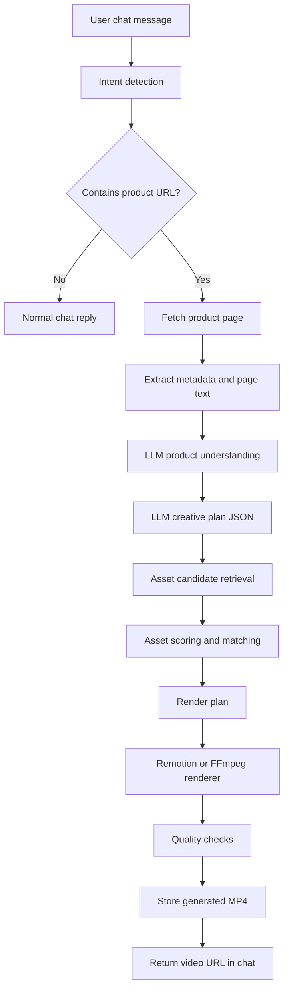

# YEC Founding Engineer Task — System Architecture and Build Plan

## Purpose of this document

This file describes how to build the system. It is written for an AI coding agent that will implement the project.

The product is a chat-based meme/UGC video generator. The app reads a product URL, understands the product, creates a meme-style caption, selects a matching GIF/reaction asset, matches audio and background, renders a vertical MP4, and returns the result in chat.

---

# 1. Recommended stack

Use this stack unless there is a strong reason not to:

- Next.js with TypeScript.
- Tailwind CSS for UI.
- API routes or server actions for backend orchestration.
- OpenAI/Claude-compatible LLM API for product understanding and creative planning.
- GIPHY API for reaction GIF/sticker candidates.
- Local JSON manifest for fallback assets.
- Remotion or FFmpeg for rendering.
- Local file output for MVP, then S3/R2/Supabase Storage for deployed version.
- SQLite or simple JSON files for the assessment MVP.
- Postgres later if needed.

## Rendering choice

Preferred for assessment:

- Remotion if we want clean React/TypeScript video composition.
- FFmpeg if we want low-level reliability and speed.

Strong practical choice:

> Use Remotion for layout and composition, because text/GIF/background positioning is much easier in React. Use FFmpeg/ffprobe only for validation or fallback processing.

---

# 2. High-level architecture



---

# 3. Project structure

Use a structure close to this:

```text
app/
  page.tsx
  api/
    chat/route.ts
    generate-video/route.ts
components/
  Chat.tsx
  MessageBubble.tsx
  VideoPreview.tsx
lib/
  llm/
    productAnalyzer.ts
    creativePlanner.ts
    prompts.ts
  scraping/
    extractUrl.ts
    fetchProductPage.ts
    parseMetadata.ts
  assets/
    manifest.ts
    giphy.ts
    matcher.ts
    scoring.ts
  render/
    renderVideo.ts
    buildRenderPlan.ts
    validateOutput.ts
  jobs/
    jobStore.ts
  utils/
    ids.ts
    logger.ts
remotion/
  MemeVideo.tsx
  Root.tsx
public/
  generated/
assets/
  backgrounds/
  audio/
  reactions-fallback/
  manifest.json
```

Keep files small. Separate product understanding, creative planning, asset matching, and rendering.

---

# 4. Main backend flow

## Input

The main generation endpoint receives:

```ts
type GenerateVideoRequest = {
  message: string;
  previousContext?: {
    productName?: string;
    productUrl?: string;
    lastCreativePlan?: CreativePlan;
  };
  vibeOverride?: "funny" | "dramatic" | "genz" | "premium" | "chaotic" | "less-cringe";
};
```

## Output

```ts
type GenerateVideoResponse = {
  status: "success" | "error";
  videoUrl?: string;
  caption?: string;
  creativePlan?: CreativePlan;
  selectedAssets?: SelectedAssets;
  error?: string;
};
```

---

# 5. Intent detection

The chat system needs a simple router.

Possible intents:

- greeting;
- capability question;
- generate video;
- regenerate video;
- change vibe;
- error recovery.

For MVP, intent detection can be rule-based plus LLM fallback.

Rules:

- If message contains URL, intent is `generate_video`.
- If message contains “again,” “another,” “regenerate,” intent is `regenerate`.
- If message contains “funnier,” “dramatic,” “less cringe,” intent is `change_vibe`.
- If message is short greeting, intent is `small_talk`.

---

# 6. Product extraction and understanding

## URL extraction

Use regex to extract the first URL from the message.

Support:

- `https://example.com`
- `http://example.com`
- `example.com`
- `www.example.com`

Normalize missing schemes to `https://`.

## Webpage fetching

Fetch the page with timeout and graceful fallback.

Extract:

- title;
- meta description;
- Open Graph title;
- Open Graph description;
- main visible text;
- hero headline if possible;
- app/product name;
- screenshots/images if easy.

If scraping fails, use only the user’s message.

## Product analysis output

The LLM should return this structure:

```ts
type ProductUnderstanding = {
  productName: string;
  productUrl: string;
  category: string;
  oneLineSummary: string;
  targetUser: string;
  userPain: string;
  oldWorkflow: string;
  productBenefit: string;
  emotionalBeforeState: "confused" | "stressed" | "annoyed" | "bored" | "overwhelmed" | "embarrassed";
  emotionalAfterState: "relieved" | "confident" | "smug" | "happy" | "calm";
  memeAngles: string[];
};
```

---

# 7. Creative planning

The LLM should not directly pick final files.

It should create a structured creative plan.

```ts
type CreativePlan = {
  caption: string;
  memeFormat:
    | "me-when"
    | "pov"
    | "before-after"
    | "pretending-to-know"
    | "manual-vs-automated"
    | "realization";
  humorStyle: "relatable" | "absurd" | "dry" | "genz" | "dramatic";
  reactionMood: "confused" | "panic" | "shocked" | "relief" | "smug" | "crying" | "celebrating";
  audioMood: "funny" | "dramatic" | "chill" | "chaotic" | "victory";
  backgroundCategory: "room" | "office" | "sky" | "phone" | "gradient" | "lifestyle";
  backgroundMood: "clean" | "premium" | "neutral" | "dramatic" | "funny";
  durationSec: number;
  template: "top-caption-bottom-reaction";
  giphyQueries: string[];
};
```

## Caption rules

The caption should:

- be lowercase unless brand name requires casing;
- be short enough for 2–4 lines;
- sound like a meme, not ad copy;
- include the product name or domain naturally;
- focus on the user pain or old workflow;
- avoid generic phrases like “revolutionize,” “seamless,” “unlock productivity.”

Good examples:

```text
me pretending i know my macros so i just open calai.app and let it handle it
```

```text
pov: you’re still logging calories manually like it’s a tax return
```

```text
me after discovering calai.app does the food math before i panic
```

Bad examples:

```text
calai is an innovative ai-powered calorie tracking solution for modern users
```

```text
boost your health journey with seamless nutrition insights
```

---

# 8. GIPHY integration strategy

GIPHY is not the full asset library.

GIPHY is the external supplier of reaction candidates.

The app still needs its own asset intelligence layer.

## Recommended GIPHY usage

Use GIPHY API search to fetch reaction GIF/sticker candidates.

Prefer sticker/transparent-style queries when possible:

- `confused reaction transparent`
- `shocked sticker`
- `crying sticker`
- `side eye reaction`
- `panic calculating`
- `relieved reaction`
- `celebrating sticker`

For rendering, prefer MP4 renditions from the GIPHY response if available.

Avoid raw GIF when possible because MP4 is easier and more efficient in rendering.

## GIPHY candidate type

```ts
type GiphyCandidate = {
  giphyId: string;
  title: string;
  sourceUrl: string;
  mp4Url?: string;
  webpUrl?: string;
  width: number;
  height: number;
  rating?: string;
  queryUsed: string;
  inferredMood: CreativePlan["reactionMood"];
  inferredEnergy: "low" | "medium" | "high";
  isStickerLike: boolean;
  score: number;
};
```

## Important fallback rule

Do not depend completely on GIPHY live search.

Keep local fallback assets so the demo always works.

Use this strategy:

1. Try GIPHY.
2. Score and validate candidates.
3. If no good candidate, use local fallback reaction asset.

---

# 9. Asset manifest

Create a local manifest for backgrounds, audio, and fallback reactions.

```ts
type ReactionAsset = {
  id: string;
  filePath: string;
  type: "gif" | "mp4" | "webm";
  mood: "confused" | "panic" | "shocked" | "relief" | "smug" | "crying" | "celebrating";
  energy: "low" | "medium" | "high";
  action: "thinking" | "dancing" | "crying" | "staring" | "celebrating" | "pointing";
  hasTransparentBackground: boolean;
  durationSec: number;
  loopable: boolean;
  preferredPosition: "bottom-center" | "center" | "bottom-right";
  preferredScale: number;
  tags: string[];
};
```

```ts
type AudioAsset = {
  id: string;
  filePath: string;
  mood: "funny" | "dramatic" | "chill" | "chaotic" | "victory";
  energy: "low" | "medium" | "high";
  bpm?: number;
  durationSec: number;
  hasBeatDrop: boolean;
  beatDropAtSec?: number;
  tags: string[];
};
```

```ts
type BackgroundAsset = {
  id: string;
  filePath: string;
  type: "image" | "video";
  category: "room" | "office" | "sky" | "phone" | "gradient" | "lifestyle";
  mood: "clean" | "premium" | "neutral" | "dramatic" | "funny";
  busyTopArea: boolean;
  busyCenterArea: boolean;
  safeTextZone: "top" | "middle" | "bottom";
  tags: string[];
};
```

---

# 10. Asset scoring

The asset matcher should not choose randomly.

Use a scoring function.

```ts
score =
  moodMatch * 0.35 +
  energyMatch * 0.20 +
  semanticMatch * 0.20 +
  layoutCompatibility * 0.15 +
  trendOrFreshness * 0.10;
```

For MVP, use simple numeric helpers:

- exact mood match = 1.0;
- related mood = 0.6;
- mismatch = 0.1;
- exact energy match = 1.0;
- adjacent energy = 0.6;
- mismatch = 0.2;
- layout safe = 1.0;
- layout risky = 0.3.

## Mood mapping

```ts
const moodMap = {
  confused: {
    goodReactions: ["confused", "panic", "shocked"],
    goodAudio: ["funny", "dramatic"],
  },
  panic: {
    goodReactions: ["panic", "crying", "shocked"],
    goodAudio: ["chaotic", "dramatic"],
  },
  relief: {
    goodReactions: ["relief", "smug", "celebrating"],
    goodAudio: ["victory", "chill", "funny"],
  },
};
```

---

# 11. Render plan

The final renderer should receive a deterministic render plan.

```ts
type RenderPlan = {
  output: {
    width: number;
    height: number;
    fps: number;
    durationSec: number;
  };
  caption: {
    text: string;
    fontFamily: string;
    fontSize: number;
    fontWeight: number;
    color: string;
    strokeColor: string;
    strokeWidth: number;
    position: "top-center";
    maxWidth: number;
  };
  background: {
    filePath: string;
    type: "image" | "video";
  };
  reaction: {
    filePathOrUrl: string;
    type: "mp4" | "webm" | "gif";
    position: "bottom-center" | "center";
    scale: number;
    startAtSec: number;
  };
  audio: {
    filePath: string;
    startAtSec: number;
    volume: number;
  };
};
```

Default output:

```ts
{
  width: 512,
  height: 910,
  fps: 30,
  durationSec: 8
}
```

The examples are close to 512 × 910, so this is acceptable for the assessment.

Optional production format:

```ts
{
  width: 1080,
  height: 1920,
  fps: 30
}
```

---

# 12. Layout rules

Use one reliable template first.

Template name:

```text
top-caption-bottom-reaction
```

Layout:

- background fills entire frame;
- caption top-center;
- reaction bottom-center or center;
- audio plays throughout;
- video length 7–9 seconds by default.

Caption style:

- white text;
- black stroke;
- bold sans-serif;
- centered;
- 2–4 lines;
- safe top margin;
- no fancy animation required.

Approximate values:

```ts
const layout = {
  canvas: { width: 512, height: 910 },
  caption: {
    y: 110,
    maxWidth: 420,
    fontSize: 28,
    strokeWidth: 4,
  },
  reaction: {
    width: 360,
    bottom: 40,
  },
};
```

---

# 13. Quality checks

After rendering, run basic validation:

- output file exists;
- duration is between 5 and 12 seconds;
- video has audio stream;
- file size is reasonable;
- video is vertical;
- caption is not empty;
- selected reaction exists or URL is accessible;
- fallback was used if external API failed.

Use `ffprobe` if using FFmpeg.

Minimum check:

```bash
ffprobe -v error -show_entries format=duration -of json output.mp4
```

---

# 14. API endpoints

## POST `/api/chat`

Handles normal chat routing.

Responsibilities:

- classify message intent;
- if generation requested, call `/api/generate-video` logic internally;
- return assistant messages;
- preserve session context.

## POST `/api/generate-video`

Responsibilities:

1. Extract URL.
2. Fetch product page.
3. Analyze product.
4. Generate creative plan.
5. Fetch GIPHY candidates.
6. Match assets.
7. Build render plan.
8. Render video.
9. Return URL.

---

# 15. Build phases

## Phase 1 — Working shell

- Create Next.js app.
- Build chat UI.
- Add fake progress states.
- Return mocked video URL.

## Phase 2 — Product understanding

- URL extraction.
- Page fetch.
- Metadata parser.
- LLM product understanding.
- LLM creative plan JSON.

## Phase 3 — Static asset renderer

- Add local background, reaction, and audio assets.
- Build deterministic render plan.
- Render one MP4 with Remotion/FFmpeg.
- Return video in chat.

## Phase 4 — Asset matching

- Build manifest.
- Build mood/energy scoring.
- Select assets from plan.
- Add fallback behavior.

## Phase 5 — GIPHY integration

- Generate search queries.
- Fetch candidates.
- Prefer sticker/transparent style candidates.
- Score and select.
- Fall back locally if needed.

## Phase 6 — Regeneration and vibe control

- Add “make it funnier.”
- Add “try another GIF.”
- Add “make it dramatic.”
- Reuse previous product context.

## Phase 7 — Polish and deploy

- Loading states.
- Error handling.
- README.
- Deploy.
- Test on 3–5 products.

---

# 16. Environment variables

Expected `.env.local`:

```text
OPENAI_API_KEY=
GIPHY_API_KEY=
NEXT_PUBLIC_APP_URL=http://localhost:3000
STORAGE_MODE=local
```

If using cloud storage:

```text
S3_BUCKET=
S3_REGION=
S3_ACCESS_KEY_ID=
S3_SECRET_ACCESS_KEY=
```

---

# 17. Acceptance criteria

The implementation is acceptable if:

- User can paste a product URL in chat.
- The app responds naturally to normal messages.
- The app generates a meme caption based on the product.
- The app selects a reaction GIF/video based on mood.
- The app selects audio based on mood.
- The app renders a vertical MP4.
- The MP4 includes background, caption, reaction, and music.
- The final video is returned in the chat.
- The app does not fail if GIPHY fails.
- The README explains architecture clearly.

---

# 18. Implementation warning

Do not overbuild before the first end-to-end path works.

The first milestone should be:

> User message → mocked product plan → local assets → rendered MP4 → chat response.

Only after this works should GIPHY, better scoring, regeneration, and deployment polish be added.

